# Sharify

## Team: Pineapple
- ### Alena Qin (qinalena)
  - User Stories: [Search songs, add/remove songs to/from a playlist](#search-songs-addremove-songs-tofrom-a-playlist)
- ### Junyu Li (Jasjas7777)
  - User Stories: [Signup/Login/Logout an account](#signup--login--logout-an-account)
- ### Don Prathap C. Edirisinghe (DonPrathap)
  - User Stories: [Interact with friends through chat feature and commenting on their playlists](#interact-with-friends)
- ### Aseef Ali Hasan (aseef2289)
  - User Stories: [View and manage friends list](#view-and-manage-friends-list)
- ### Ashleigh Wong (Ash-uwu)
  - User Stories: [View and manage a playlist collection](#view-and-manage-a-playlist-collection)
  - Additional: README file
____
## Software Specification
- Domain: Social Media

This program is a social media platform that allows users to connect with
others through their common interests in music.

When the user opens the app, they will be prompted to either sign up for an account by creating an account with a username and password
or log into their existing account.  Once logged in, the user will have access to their own user profile, where a default bio is displayed. They
can write a new bio, change their password, and view their friends list and playlist collection.

In a user's playlist collection, they can add or remove playlists. Opening a specific playlist displays the songs stored. 
The user can remove songs or add new songs using a search function. The user can also comment on the playlists of their friends.

Users will also have their own friends list, where they can add other users to this list or remove them from it.  
Any users that are friends will be able to view each other’s account profiles and chat with each other.
____
## Table of Contents
- ### [Features of Shareify](#features-of-shareify)
- ### [Installation instructions](#installation-instructions)
- ### [Usage Guide](#usage-guide)
- ### [License](#license)
- ### [User Stories](#user-stories)
- ### [Entities](#entities)
- ### [Use Cases](#use-cases)
- ### [API](#api)
____
## Features of Shareify

### Login
Through the welcome page, user will be prompted to log into their account if they have already created one.
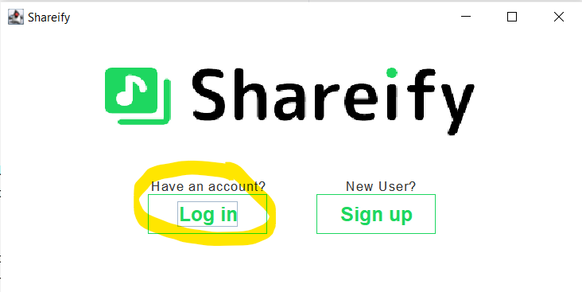

User will input their username and password within the given text fields, and click Login.  
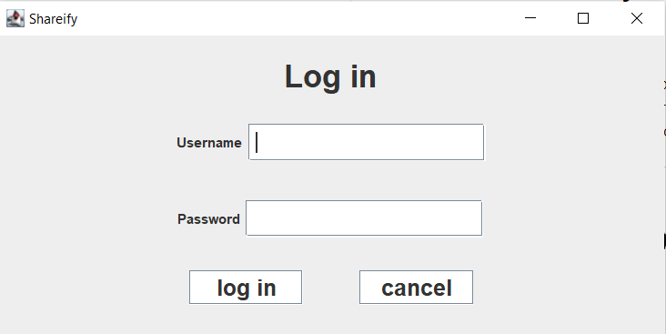

### Sign up
Through the welcome page, user will be prompted to create a new account / sign up if they do not have an 
existing account. 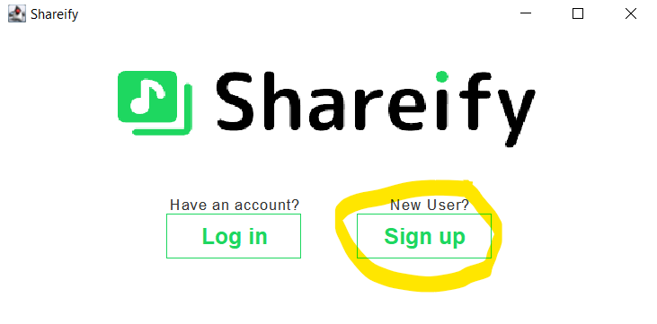

User will be asked to input a username, and password within the given text fields.  User will be 
required to put in the password twice for password confirmation, ensure what they've entered in is the same.  User
will then click the 'Sign Up' button. 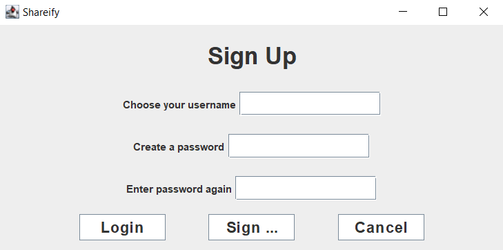

### Bio
Through the user's profile page, which is shown right after the login/sign up page, user's can type in a bio to talk
about themselves, and provide details about their interests or anything else they would like.  This feature can be 
access through the 'Edit Bio' button, which will then lead the user to the bio page where they can type in whatever they
like.  User must save their progress by clicking the 'Save' button. 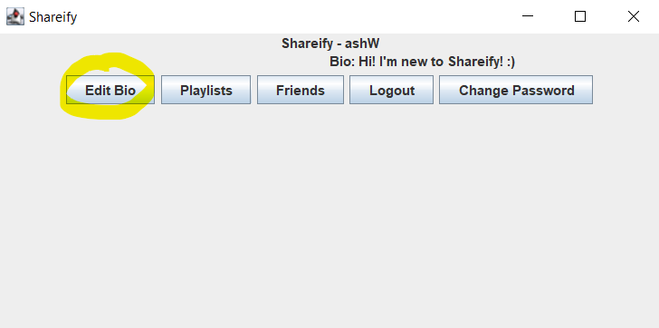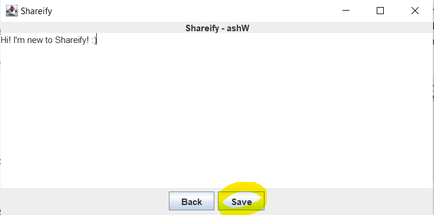

### Creating playlists
User's will be able to create their own playlists!  This can be accessed through the 'Playlists' button in the user's
profile view.  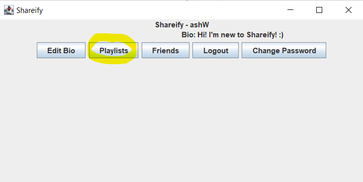

Once clicked, it will lead to the playlist collection page where all playlists will be displayed.  User 
can create a playlist by clicking the 'Create Playlist' button, which will then prompt them to type in a name for the 
playlist in the text field provided. 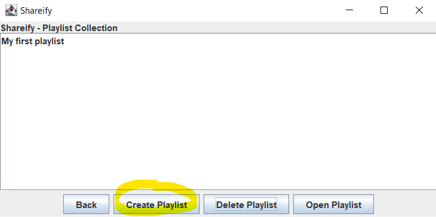

User will be prompted to click the 'Save' button, or 'Cancel' if they decide they
don't want to create a new playlist. 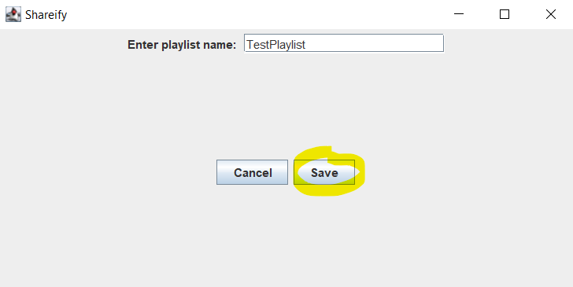

Both buttons will lead back to the playlist collection view, with the new playlist
showing in the scrollPane of the playlist collection view. 
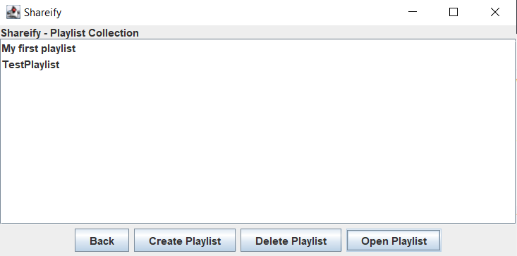

## Deleting playlists
User's can delete their playlists by selected a playlist they want to delete by clicking the name of the playlist
listed, and click the 'Delete Playlist' button.
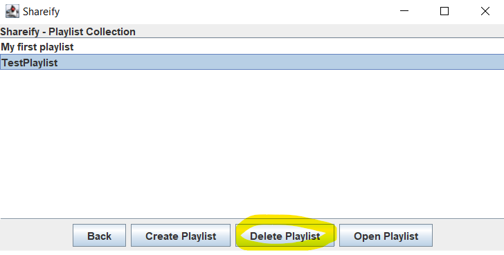

### Adding songs
User's can add songs to their playlist by selecting the playlist they want songs added to, click the 'Open Playlist' 
button. 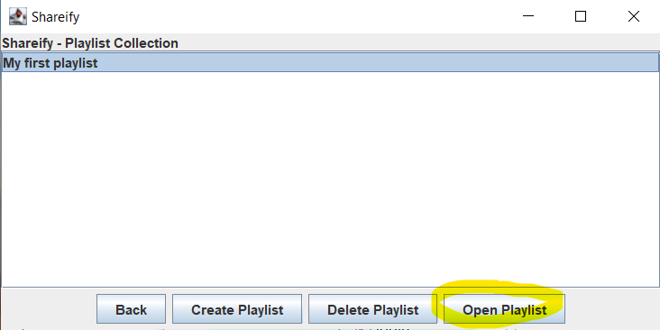

Then, as it leads you to the playlist's view, click 'Search Tracks'.
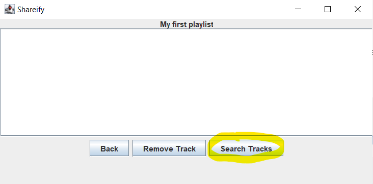 

It will then lead you to a view where you can search for a song by it's title.  User will type in the song they'd like
in the text field on the top of the page, and then click 'Search'. 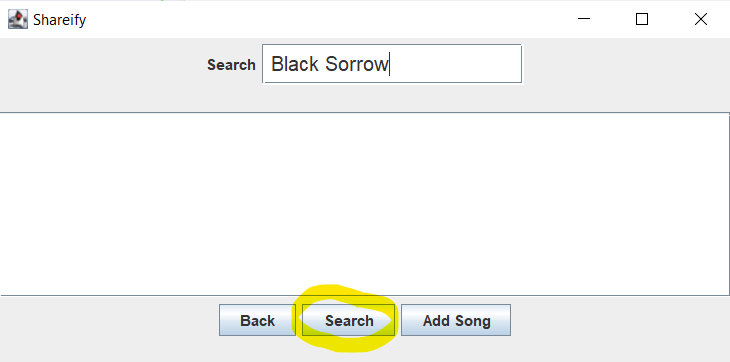

After the 'Search' button has been clicked, the user will select the correct song they want within the 
scrollPane on the bottom of the page that's been provided by the Spotify API, and then click the 'Add Song' button.
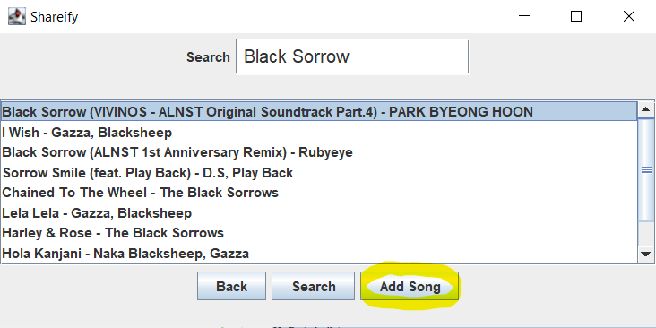

User will be prompted to click the 'Back' button to return to the playlist and see the song they added within the 
playlist. 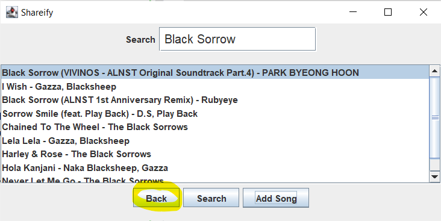 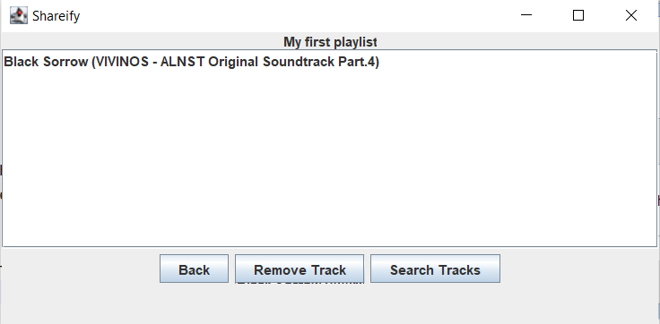

### Removing songs
User's can remove a song in their playlist by simply selected the song they don't want within the playlist, and then 
click 'Remove Track'. 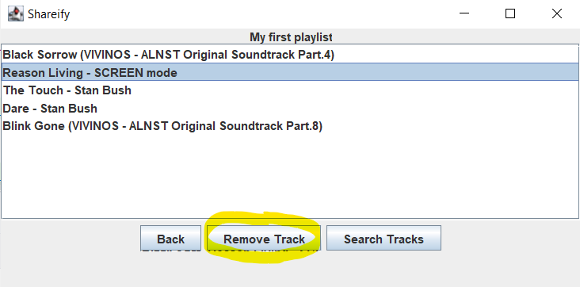 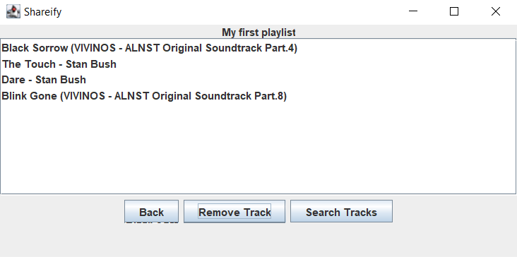

### Making friends
User's can add other users on the Shareify app as friends in their friend list.  User can access their friend list
through the User Profile view, and then clicking the button 'Friends'.
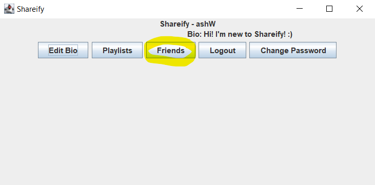

User will first see an empty Friend list if they currently do not have friends, but don't worry!
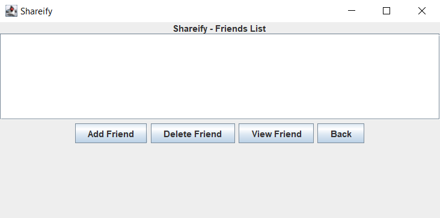

To add a friend, click the 'Add Friend Button'.
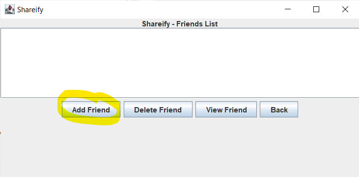

Type in your friend's username in the text field and click 'Save', or the 'Back' button to cancel.  Your new friend will
then pop up on the Friend list!
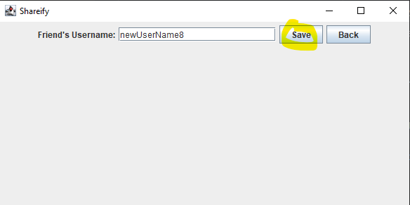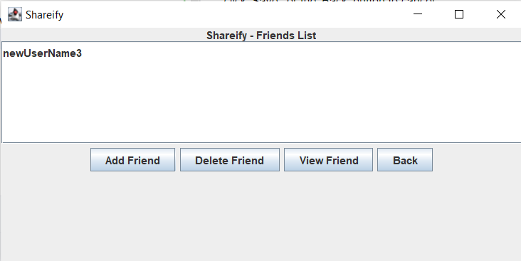

### Deleting a friend
User can delete friends from their Friend list by selecting the friend they don't want, and then clicking the 
'Delete Friend' button.

### Viewing Friend's info
User can view their friend's playlists, and their friend's friend list!  User can access this by selected the friend's
username in the Friends List, and clicking the 'View Friend' button.  In there the user can click 'View Playlists' to 
see the friend's playlist or click 'View Friends' to see the friends list of this friend.
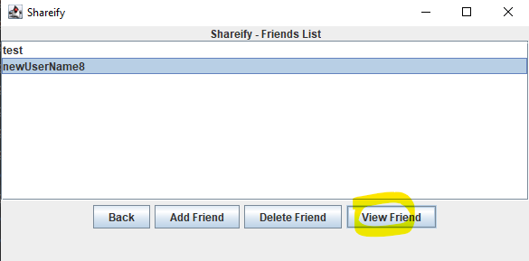

Viewing playlist:
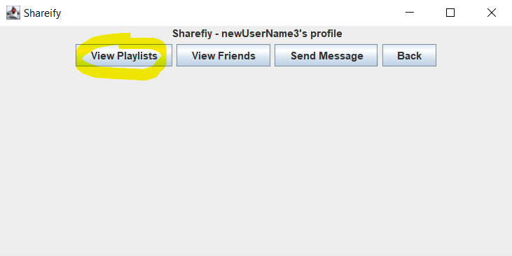
Playlists would be listed here, this user currently has no playlists:
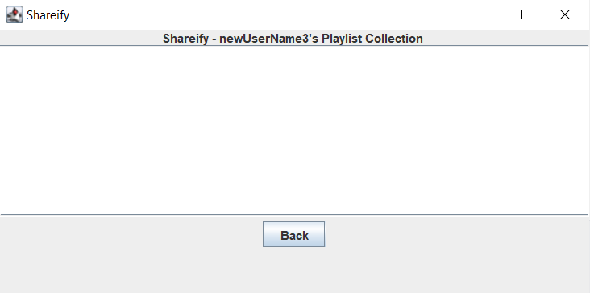

Viewing friends list:
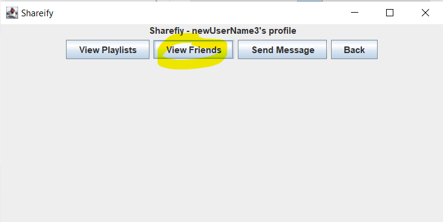
Friends would be listed here, this user currently has no friends :(
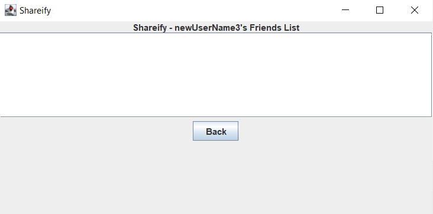

### Chatting with friends
User's can chat with their friends by selecting the friend they want to chat with on their Friends List, click 
'View Friend' button, and then click the 'Send Message' button. 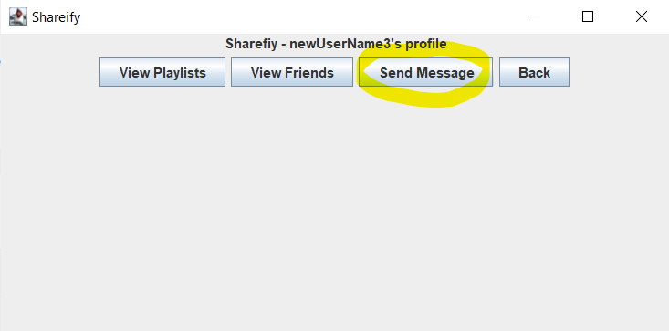

To send a message, type something you want to say to the other user in the text field on the bottom of the page,
and then click 'Send Message'. 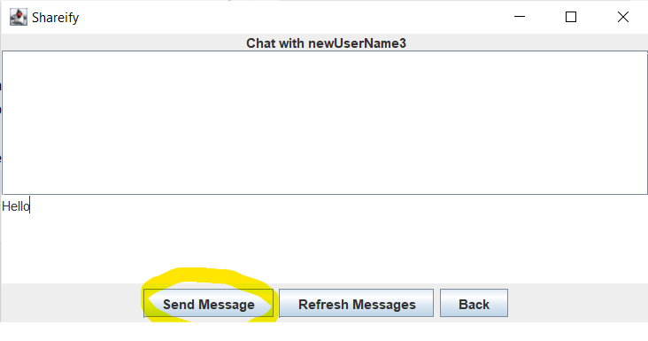

Message will be seen in message view above the text field.
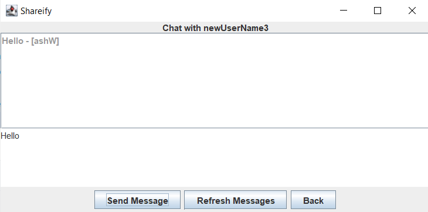

If user exits the message page, and decides to chat with their friend another day.  To get your message history, simply
click the 'Refresh Message' button, and all messages will show. 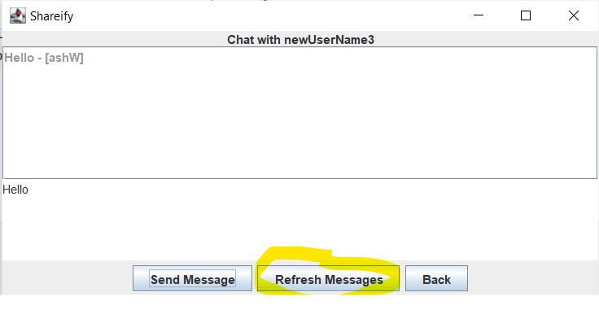

### Change password
If the user decided that they want to change their password, through the user's profile view, click 'Change Password'.
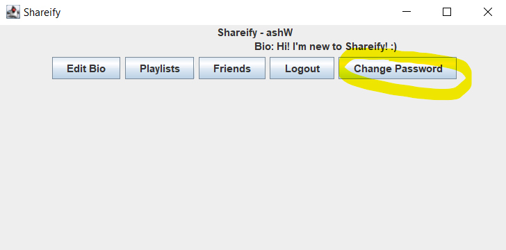

User will be prompted to put in a new password in the text field, and then click 'Change Password' to save this change.
User can also click the 'Back' button if they change their mind.
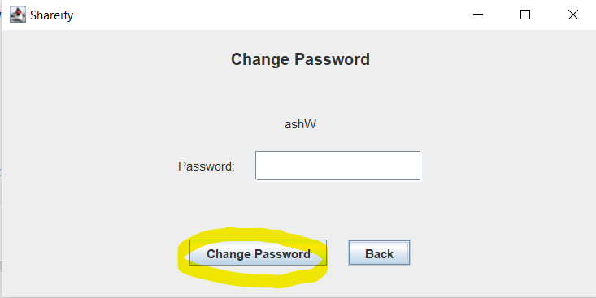

### Logout
User's can log out of their account by click the "Logout' button on their profile view.
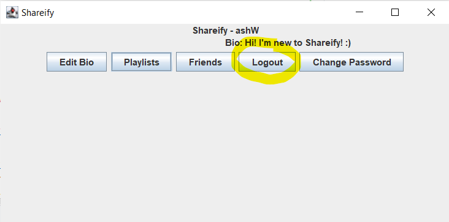

After logging out, it will bring the user back to the welcome screen.
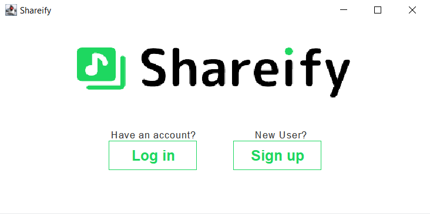
____
## Installation instructions
#### Steps to access the Shareify app:
1. On your github, clone the repository.  This is the link of the 
repository on the github website: https://github.com/qinalena/Shareify
2. You will then click the green '<>Code' button, and copy the HTTPS link 
(https://github.com/qinalena/Shareify.git)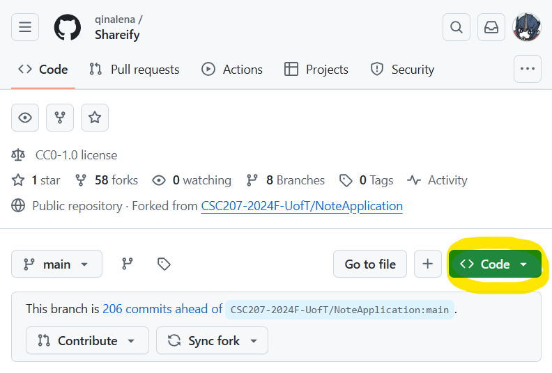
3. Open your IntelliJ, and on the welcome screen click 'Get from VCS' button on
the top right, and then paste the HTTPS link in the URL text field and click 'Clone'.
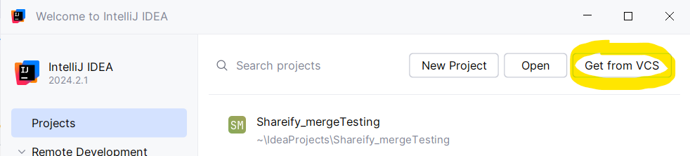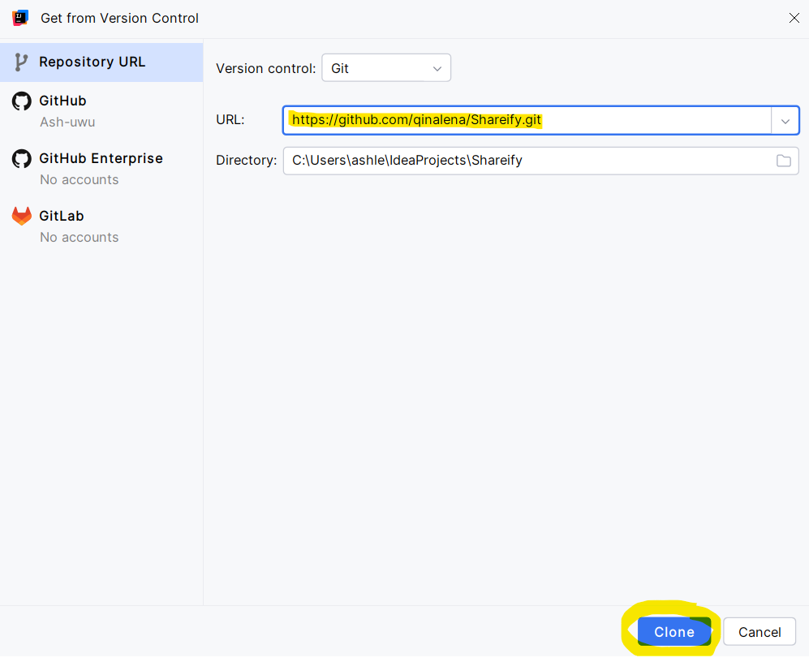
4. On the left panel 'Project', open the src folder -> main folder -> java folder -> app package
-> run 'MainShareifyApplication'

Now you can play around with the app, and its features!

____
## Usage Guide

**IMPORTANT:** If you would like to run the code and have access to the Spotify API, please contact 
@alena.qin@mail.utoronto.ca for environment variable!

Steps to add in environment variable:
- On IntelliJ, click Run -> Edit Configurations -> Insert environment variable

### HOW TO USE:
- Log in or create a new account on the welcome page.
- Bio
  - Type in a description in the text field of the bio view, and click the save button
  - Accessible through the user profile view, and clicking 'Edit Bio'.
- Playlists
  - To **view your playlists**, click 'Playlists' on the user profile view.
    - Playlists will be shown in the Playlist Collection page once opened.
  - To **create a playlist**, click 'Create Playlist' in the Playlist Collection page, then the view
  will change, and you can type in a name for the playlist in the provided text field.  Click 'Save' to save
  the name and set it for the newly created playlist.
  - To **delete a playlist**, click on the playlist you want to delete in the Playlist Collection view, and click 'Delete 
  Playlist'.
- Songs
  - To **add a song** to a playlist, click the playlist you want in the Playlist Collection view, click 'Open Playlist', 
  and then click 'Search Tracks'. Type in the song you want in the text field, click 'Search', selected the correct song
  and click 'Add Song'. Click the 'Back' button, and you will see the song added to your playlist.
  - To **remove a song**, selected the song you want to remove in your playlist, and click 'Remove Track'.
- Friends
  - To **add a friend** to your friend list, click 'Friends' on the user profile, click 'Add Friend' in the Friends List 
  view, input the friend's username and click 'Save'.
  - To **remove a friend** from your friend list, select the friend you don't want on the Friends List view, and click 
  'Delete Friend'.
  - To **view your friend's playlists**, select the friend you want on the Friend List view, click 'View Friend', and in the 
  Friend's profile view, click 'View Playlists'
  - To **view your friend's friend list**, select the friend you want on the Friend List view, click 'View Friend', and in
  the Friend's profile view, click 'View Friends'
- Chat
  - To **message a friend**, on the Friend List view, select a friend, click 'View Friend', then on the friend's profile, 
  click 'Send Message'.  You can then type a message in the text field and click 'Send Message'.
  - To **get message history**, click 'Refresh Messages' in the Chat view
- Change password
  - To **change your password**, on the user profile click 'Change Password', and then in the change password view, input 
  your new password in the text field, and then click 'Change Password' to save it.
- Logout
  - To **log out**, click the 'Logout' button on the user profile, and it will bring you back to the welcome page, 
  successfully logging the user out.
____

## License
Link to code license: [LICENSE](LICENSE)
____
## User Stories
### Customize and manage an account profile
Users have a user profile which will display basic personal information (username and bio), their friends list,
and their playlist collection. Users can write and edit a custom bio. ***[Team]***

### Signup / Login / Logout an account
Users can sign up for an account by creating a friendUsername and password. The app will show the “This User is taken”
to avoid repetition in usernames if the user creates a user with a username that already exists. They could log in to or log out
their account. A new account starts with an empty playlist collection. ***[Junyu Li]***

### View and manage a playlist collection
Users can create, delete, view, and manage their playlists that are stored within the playlist collection. 
Users will be able to see the playlists that they have created through the playlist collection view, which
displays all playlists that have been created by the user.  To add a new playlist, user clicks the 'create playlist'
button, inputs a name of their choosing in the text field, click save, and the playlist will be shown in the 
playlist collection view.  Users can also delete their playlist by selecting it and clicking the 'delete playlist'
button.  Users can open their playlists by clicking the 'open playlist' button. ***[Ashleigh Wong]***

### Search songs, add/remove songs to/from a playlist
Users can open playlists in their playlist collection, displaying any previously added songs. 
Users can remove songs or add new songs using the search function, which will display the 10 most relevant songs to the query. 
***[Alena Qin]***

### View and manage friends list
Users can view their friends list which is linked to their profile. Friends can be added and removed. Users can also
view their friends’ account profiles. ***[Aseef Ali Hasan]***

### Interact with friends
Users can message their friends by viewing a friend from the User's friend list, inputting a message, and sending it. 
Users can also view their friend's playlists and comment on them, being able to see everyone else's comments on that 
playlist aswell. ***[Don Edirisinghe]***
----
## Entities
- User
  - username
  - password
  - note
  - info
- Tracks
  - Name
  - Artist
  - Genre
- Playlist
  - Name
  - Tracks
____
## Use Cases
- Login
- Sign up
- User Profile
- Note/Bio
- Change password
- Logout
- Playlist Collection
  - Add Playlist
- Add songs
  - Search for songs
- Create friend list
  - Add friends
- Message friend
- Comment on friend's playlists
____
## API
- Spotify Web API: https://developer.spotify.com/documentation/web-api/reference/get-an-album

-> Provides access to songs, albums, and genres of songs within Spotify
____
## Feedback
User's can provide us feedback on the Shareify app by opening an issue on the repository, or you can open
a discussion board and make sure to tag one of us to reach out to us.
____
## Contributions
User's can contribute to our app by forking the repository on the github website: https://github.com/qinalena/Shareify
and making any changes they feel is necessary to improve the Shareify app.

To fork it, simply click the 'Fork' button, this should make a copy of the repository for you.

### Tips:
- Good merge request
  - Provide a clear and concise description of the changes you've made
    - Explain the purpose of the merge request, and why the changes are necessary
    - Specify what's included and what's excluded
  - Use meaningful commit messages
  - Include tests (unit tests, integration tests, end-to-end tests) to verify the new functionalities
    - Ensure all tests pass before submitting merge request
  - Check Project's coding guidelines and ensure the code adheres to them
  - Add documentation
  - Make sure it's conflict free!
- Protocols
  - Review
    - Make sure you understand the context, read the merge request descriptions and linked issues to understand the 
    changes
    - Provide actionable feedback and suggest improvements
    - Focus on key areas (ex: Code correctness, performance and efficiency, test coverage, adherence to coding 
    standards, etc.)
  - Merge
    - Make sure you have at least one approval of the merge request from a reviewer
    - Resolve merge conflicts
    - Verify all test pass
    - Approve only when satisfied with quality

